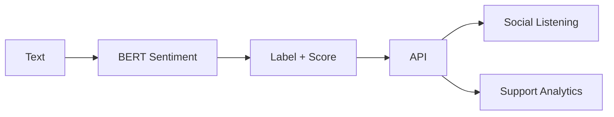

# Operationalization – Sentiment_Analyzer_BERT

## System flow

## Target user, value proposition, deployment

**Target user:** Social listening and support analytics teams. **Value proposition:** Text in, sentiment label and confidence out; scalable for batch or streaming. **Deployment:** REST API; optional batch endpoint; integrate with social or support tools.

## Next steps

1. **Reproducible run script:** Load model and tokenizer; run baseline (e.g. VADER) and BERT on a small test set; print F1 and accuracy.
2. **FastAPI wrapper:** Single endpoint: text in, label and score out.
3. **Dockerize:** Container with model cache for consistent deployment.
