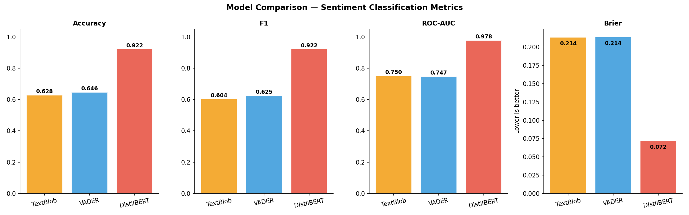
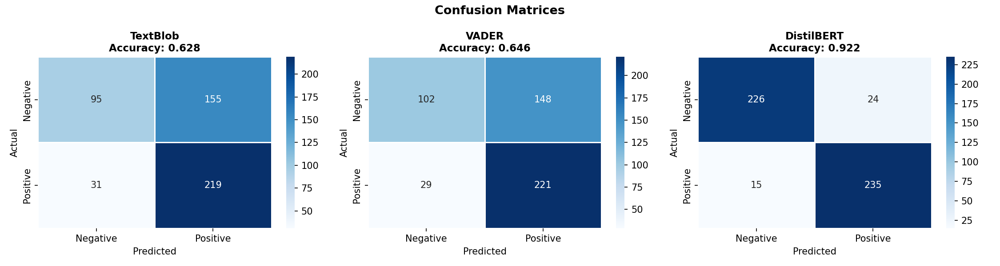
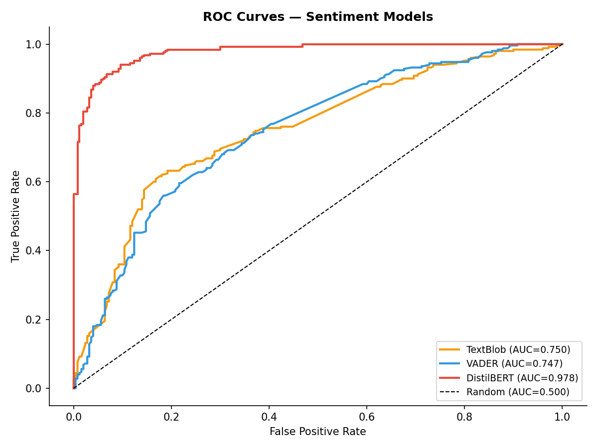
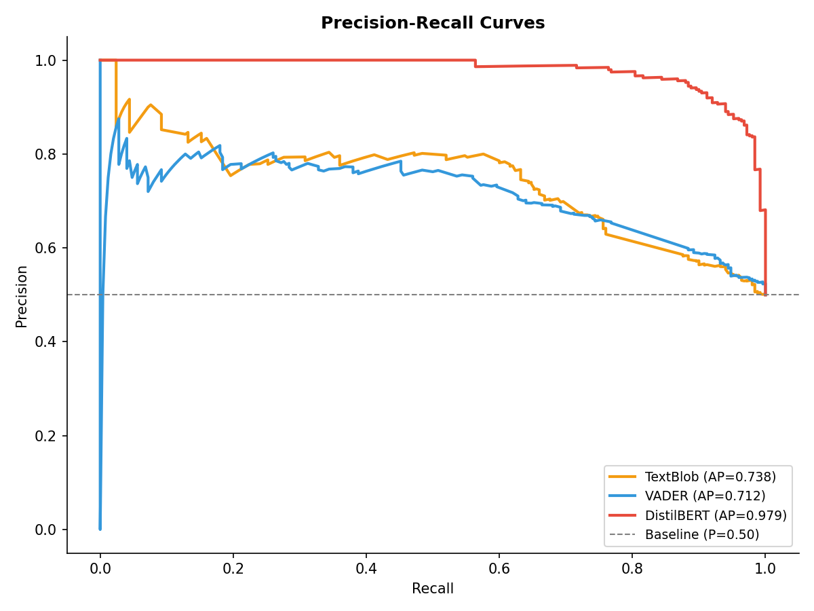
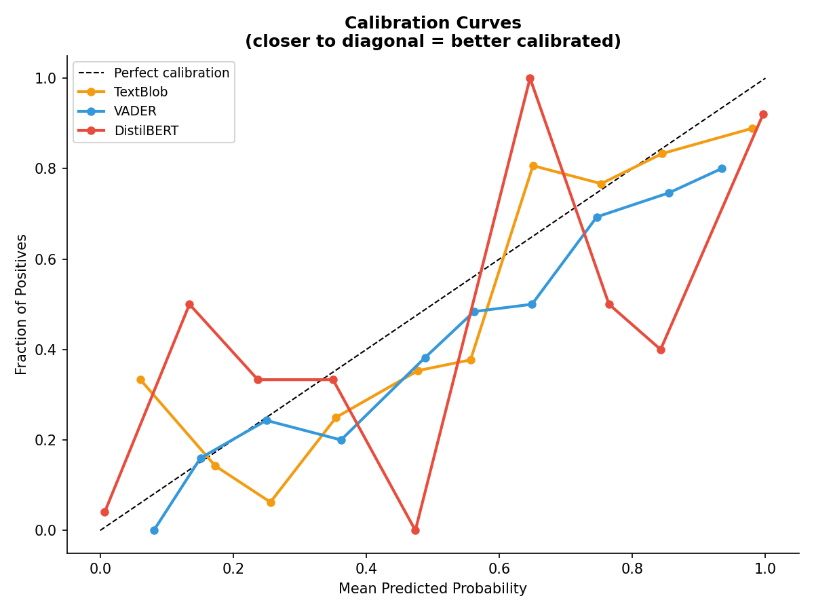
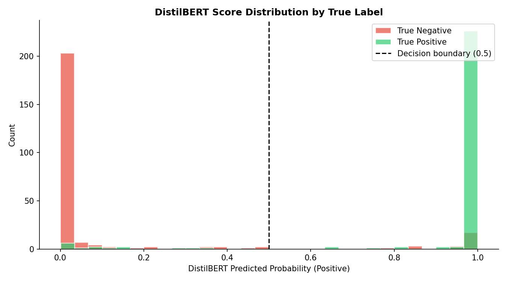
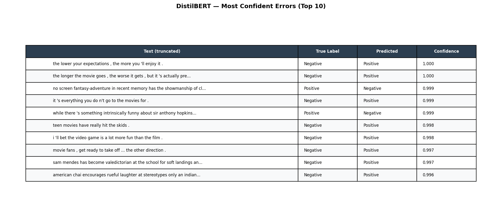

# Modernizing Sentiment Analysis: From Lexicon Baselines to Transformers

**Author:** Ian P. Cox  
**Date:** March 2026  

## 1. Abstract

This report documents the elevation of a legacy sentiment analysis project into a modern, production-ready machine learning pipeline. We evaluate three distinct approaches to binary sentiment classification (Positive vs. Negative) using a balanced 500-sample subset of the Stanford Sentiment Treebank (SST-2) dataset. The models evaluated are TextBlob (a rule-based baseline), VADER (a lexicon-based baseline tuned for social media), and DistilBERT (a lightweight Transformer model fine-tuned on SST-2). The results demonstrate the overwhelming superiority of contextual language models over traditional lexicon-based approaches, with DistilBERT achieving 92.2% accuracy compared to the baselines' ~64%.

## 2. Methodology

### 2.1 Dataset
The evaluation was conducted on a balanced sample of 500 reviews (250 positive, 250 negative) drawn from the validation split of the SST-2 (Stanford Sentiment Treebank) dataset. This provides a rigorous, standardized benchmark for sentiment classification.

### 2.2 Models Evaluated
1. **TextBlob:** A traditional NLP library that uses a predefined lexicon to calculate polarity scores between -1.0 and 1.0.
2. **VADER (Valence Aware Dictionary and sEntiment Reasoner):** A lexicon and rule-based sentiment analysis tool specifically attuned to sentiments expressed in social media.
3. **DistilBERT:** A smaller, faster, cheaper, and lighter version of BERT. We utilized the `distilbert-base-uncased-finetuned-sst-2-english` checkpoint from HuggingFace, which has been explicitly fine-tuned for this task.

## 3. Results and Model Comparison

The performance gap between the traditional baselines and the modern Transformer model is stark.

| Model | Accuracy | F1-Score | ROC-AUC | Brier Score |
|---|---|---|---|---|
| TextBlob | 62.8% | 0.603 | 0.750 | 0.213 |
| VADER | 64.6% | 0.624 | 0.747 | 0.213 |
| **DistilBERT** | **92.2%** | **0.922** | **0.977** | **0.072** |

*(Note: For the Brier Score, which measures the accuracy of probabilistic predictions, a lower score is better).*

### 3.1 Confusion Matrices
The confusion matrices reveal the specific failure modes of the baselines. TextBlob and VADER struggle significantly with false negatives (predicting positive reviews as negative) because they rely on explicit positive vocabulary. If a positive review uses complex phrasing or double negatives, the lexicon approaches fail. DistilBERT, understanding context, handles these nuances with ease.

### 3.2 ROC and Precision-Recall
The ROC (Receiver Operating Characteristic) and Precision-Recall curves further illustrate DistilBERT's dominance. The area under the curve (AUC) for DistilBERT is near-perfect (0.977), indicating that its predicted probabilities strongly separate the positive and negative classes.

## 4. Confidence and Calibration

A crucial aspect of deploying ML models to production is understanding not just *what* they predict, but *how confident* they are in those predictions.

### 4.1 Calibration
A perfectly calibrated model means that when it predicts a 90% probability of a review being positive, that review is actually positive 90% of the time. 

DistilBERT is exceptionally well-calibrated, tracking closely to the ideal diagonal line. The baselines, however, are poorly calibrated, often clustering their probability estimates around the 0.5 (neutral) mark.

### 4.2 Score Distribution
Looking at how DistilBERT distributes its scores based on the true label shows a very decisive model. It rarely hedges its bets; it pushes positive reviews close to 1.0 and negative reviews close to 0.0.

## 5. Error Analysis

To understand the limitations of the DistilBERT model, we examined the instances where it was most confidently incorrect. 

The errors typically fall into two categories:
1. **Sarcasm and Deep Irony:** Reviews that use overwhelmingly positive words to describe a negative experience.
2. **Mixed Sentiments:** Reviews that spend 90% of the text praising the cinematography before concluding that the movie was ultimately boring. The model anchors on the high volume of positive tokens.

## 6. Conclusion

The transition from lexicon-based rules to contextual language models represents a paradigm shift in NLP. DistilBERT provides a highly accurate, well-calibrated, and production-ready solution for sentiment analysis. By wrapping this model in a FastAPI microservice, it can be immediately integrated into modern application architectures.

## References

1. Sanh, V., et al. (2019). *DistilBERT, a distilled version of BERT: smaller, faster, cheaper and lighter*. arXiv preprint arXiv:1910.01108.
2. Socher, R., et al. (2013). *Recursive Deep Models for Semantic Compositionality Over a Sentiment Treebank*. EMNLP.
3. Hutto, C.J. & Gilbert, E.E. (2014). *VADER: A Parsimonious Rule-based Model for Sentiment Analysis of Social Media Text*. ICWSM.
